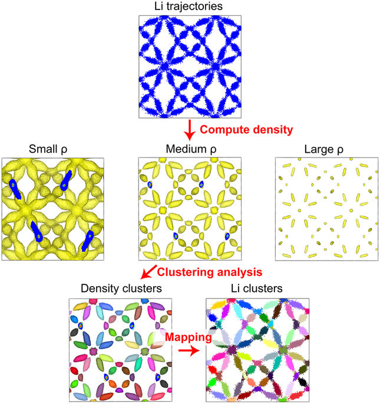

# MDCluster
This repo contains both k-means clustering algorithm and density-based clustering algorithm for analyzing trajectories of species diffusion obtained from molecular dynamics simulations. 

`dct` contains matlab code of density-based clustering of trajectories (DCT) algorithm in Ref. [1].

The algorithm is shown below. Note that the example is shown with Li trajectories, but the algorithm is general and can be applied to other trajectories or points in space in general. 

There are several steps that this algorithm follows

1. First the ion density is calculated from the trajectories. The result is similar to a CHGCAR in VASP calculation, i.e., a 3D matrix with density values in each voxel.
2. Selecting a cutoff density that separate the dense region from the infrequently visited region. This $$\rho$$ is a hyperparameter to tune in this algorithm. In our study we used a value such that the density integral within the isosurface is a half of the total density integral. 
3. Perform a depth-first search and cluster the separated regions.
4. Remap the cluster labels for each voxel to the corresponding particles.

### Reference

[1] Chen, C., Lu, Z., & Ciucci, F. (2017). Data mining of molecular dynamics data reveals Li diffusion characteristics in garnet Li7La3Zr2O12. Scientific reports, 7, 40769.

